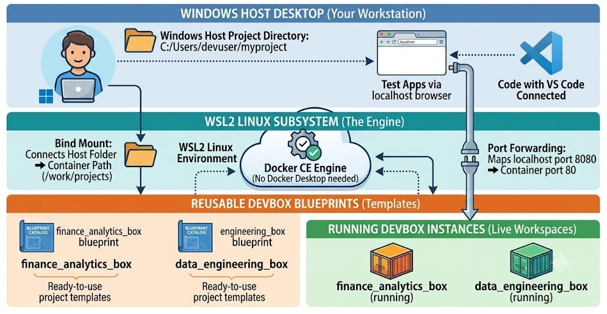

# Repeatable Linux Dev Containers on Windows Host

Use a Windows machine as your host while doing development inside ready-to-use Linux Dev Containers.

This project turns a repeatable DevBox blueprint into a running Linux workspace with its required dependencies already prepared. Windows remains your desktop and access point; your Linux tools, runtimes, services, and commands run in the DevBox. You do not need a separate Linux computer, a dual-boot setup, or Docker Desktop.



## Why use DevBox blueprints?

A blueprint is a version-controlled definition of a Linux development environment. Build it once, then create the same kind of DevBox again whenever a developer, project, test environment, or new workstream needs it.

- Spin up a prebuilt Linux environment quickly instead of repeating manual setup.
- Keep project dependencies isolated so one project does not disturb another.
- Give a team the same starting environment through Dockerfiles, dependency files, and configuration stored with the repository.
- Keep a shared base environment and build specialized boxes on top of it.
- Recreate a container after changing ports or mounted folders without reinstalling all packages.

For example, one Windows workstation can host separate DevBoxes for:

- A `finance_analytics_box` with reporting, data-processing, and database-client dependencies.
- An `api_backend_box` with a language runtime, API tooling, and test utilities.
- A `data_engineering_box` with ETL, messaging, and data-format tools.
- A `document_processing_box` with PDF, OCR, and document-conversion dependencies.

Each box has its own image, container, ports, and configuration, while still using the same Windows host.

## What this project provides

- **Reusable blueprints** for fast, consistent Linux DevBox creation.
- **Multiple project environments** on one Windows machine.
- **Windows folder access** through bind mounts, for example `/mnt/c/your-project` inside a container.
- **Container port publishing** so applications in a DevBox are reachable from Windows at `localhost:<port>`.
- **Host service access** so a DevBox can call services running in Ubuntu WSL or on Windows by IP address and port.
- **SSH and VS Code Remote-SSH** so Windows provides the editor and terminal while development runs in Linux.
- **Persistent workspaces and containers configured to restart when Docker starts** for a practical day-to-day development experience.

Docker CE runs inside the default Ubuntu WSL2 distribution. Docker Desktop is not used.

## How to get it running

### Requirements

- Windows 10 version 2004/build 19041 or later, or Windows 11.
- Hardware virtualization enabled in BIOS/UEFI.
- Internet access and several GB of free disk space.
- PowerShell run as Administrator for the first command.
- A lowercase Linux username, such as `devuser`.

You do not need WSL, Ubuntu, or Docker CE preinstalled. Host mode installs and configures them when they are missing.

### 1. Prepare the Windows host

Open **PowerShell as Administrator** in this repository and run:

```powershell
Set-ExecutionPolicy -Scope Process -ExecutionPolicy Bypass
.\setup-wsl-dev-environment.ps1 -Mode Host -UserName "devuser"
```

Host mode enables WSL2 when necessary, installs the default `Ubuntu` distribution, enables systemd, and installs Docker CE inside Ubuntu.

When the command completes, close the current PowerShell window and every Ubuntu terminal. Open a new **PowerShell as Administrator** before creating a box. This gives WSL and the Linux user session a clean start.

To opt in to sparse VHD storage:

```powershell
.\setup-wsl-dev-environment.ps1 -Mode Host -UserName "devuser" -EnableSparseVhd
```

### 2. Create and start a DevBox

```powershell
.\setup-wsl-dev-environment.ps1 -Mode Box -Box extended_box -UserName "devuser"
```

The first run builds the required images and starts the container. It also creates SSH entries in both Windows and Ubuntu WSL.

### 3. Connect and develop

```powershell
ssh extended_box
```

For VS Code, install the **Remote Development** extension pack on Windows:

1. Open the Command Palette.
2. Choose **Remote-SSH: Connect to Host**.
3. Select `extended_box`.
4. Open `/wsl/shared` in the remote VS Code window.

## DevBox blueprint model

| Blueprint | Purpose |
| --- | --- |
| `core_box/` | The shared Linux foundation used by all project boxes. It avoids repeating common setup in every project-specific image. |
| `extended_box/` | A working example of a project box built on the core foundation. Use it as a template for your own boxes. |
| `<project>_box/` | A custom project-specific box, such as `finance_analytics_box` or `api_backend_box`. |
| `<project>_box/instances/<name>/` | Optional configuration for another running instance of the same project box image. |

The folder name is exact and becomes the logical box name:

- `finance_analytics_box/` creates image `finance_analytics_box:latest` and default container `finance_analytics_box`.
- `finance-analytics-box/` preserves hyphens in the same way.
- `core_box` is reserved for the shared foundation; do not pass `-Box core_box`.

The Core DevBox is intentionally shared and reusable. The Extended DevBox demonstrates how to add project-specific dependencies and behavior without changing the core blueprint. This lets a team maintain a stable common base while evolving each project environment independently.

## Setup modes and daily commands

| Mode | When to use it | Command |
| --- | --- | --- |
| **Host** | First-time Windows, WSL2, Ubuntu, and Docker CE setup. | `.\setup-wsl-dev-environment.ps1 -Mode Host -UserName "devuser"` |
| **Box** | Build a box image and start its default container. Use after Dockerfile or dependency changes. | `.\setup-wsl-dev-environment.ps1 -Mode Box -Box extended_box -UserName "devuser"` |
| **Update** | Recreate a container after `config.json` port or bind-mount changes. The existing image is reused. | `.\setup-wsl-dev-environment.ps1 -Mode Update -Box extended_box -UserName "devuser"` |
| **Remove** | Remove a box container, its named instances, and its image. Confirmation is requested. | `.\setup-wsl-dev-environment.ps1 -Mode Remove -Box extended_box -UserName "devuser"` |

Use `-Force` only when you want to skip the replacement or removal confirmation:

```powershell
.\setup-wsl-dev-environment.ps1 -Mode Box -Box extended_box -UserName "devuser" -Force
```

## Ports, folders, and host access

Each blueprint has a `config.json` file. It controls its SSH port, application ports, and optional bind mounts.

```json
{
  "ssh_port": 2223,
  "ports": ["8080:80", "8770-8779"],
  "mounts": [
    {
      "source": "/mnt/c/Users/devuser/projects",
      "target": "/work/projects",
      "read_only": false
    }
  ]
}
```

Use absolute Linux paths for bind mounts. A Windows folder must use its WSL path, such as `/mnt/c/Users/devuser/projects`, and must already exist inside Ubuntu WSL. The target is the path visible inside the container.

For every non-core box, mounts are combined from `core_box/config.json` and the box's own `config.json`. A named instance adds its own mounts from `instances/<name>/config.json`.

Published ports are available from Windows through `localhost:<port>`. For example, `"8080:80"` makes the container's port 80 available at `http://localhost:8080` on Windows.

From a DevBox:

- Reach a service in the parent Ubuntu WSL distribution at `host.docker.internal:<port>`.
- Reach a service on the Windows host using the Windows host IP address and its port.

After changing ports or mounts, run Update mode:

```powershell
.\setup-wsl-dev-environment.ps1 -Mode Update -Box extended_box -UserName "devuser"
```

## Create a project-specific box

Copy the example blueprint, give it a clear project name, and customize its Dockerfile and configuration:

```powershell
Copy-Item -Recurse .\extended_box .\finance_analytics_box
.\setup-wsl-dev-environment.ps1 -Mode Box -Box finance_analytics_box -UserName "devuser"
```

Then edit:

- `Dockerfile` for project dependencies and build steps.
- `config.json` for SSH, application ports, and bind mounts.
- Optional startup and dependency files for project-specific behavior.

No launcher changes are required. The new folder name must be lowercase and use only letters, numbers, underscores, or hyphens.

## Run multiple instances of one box

Use an instance when you need another running container from the same image, usually with different ports or mounts:

```powershell
.\setup-wsl-dev-environment.ps1 -Mode Box -Box extended_box -Instance secondary -UserName "devuser"
```

The example instance configuration is `extended_box/instances/secondary/config.json`. It produces container and SSH alias `extended_box-secondary` while reusing the `extended_box:latest` image.

## Important files

| File or folder | Purpose |
| --- | --- |
| `setup-wsl-dev-environment.ps1` | Windows entrypoint for Host, Box, Update, and Remove modes. |
| `setup-wsl-dev-environment.sh` | Linux-side implementation run inside Ubuntu WSL. |
| `core_box/` | Shared foundation blueprint and SSH keys. |
| `extended_box/` | Example project-box blueprint. |
| `config.json` | SSH, application ports, and bind-mount configuration. |

## Troubleshooting

| Problem | What to do |
| --- | --- |
| Box mode shows a systemd user-session warning after Host mode. | Close PowerShell and Ubuntu terminals, open a fresh elevated PowerShell, and rerun the Box command. |
| `docker` is unavailable in Ubuntu. | Run `wsl --shutdown` from PowerShell, then rerun Host mode. |
| A published port is already in use. | Change the host-side port in `config.json` and run Update mode. |
| A bind mount fails. | Confirm the `source` path exists inside Ubuntu WSL and uses a Linux path such as `/mnt/c/...`. |
| WSL or sparse-VHD conversion is still running. | Wait a few minutes, run `wsl --update` if needed, then rerun Host mode. |

To remove and recreate a box, use Remove mode followed by Box mode. It retains the shared foundation image and persistent workspace volume.
